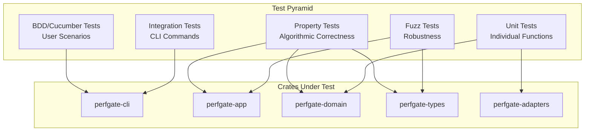

# Design Document: Comprehensive Test Coverage

## Overview

This design document outlines the technical approach for achieving comprehensive test coverage across the perfgate project. The implementation will establish a multi-layered testing strategy combining BDD tests for user-facing behavior, property-based tests for algorithmic correctness, mutation testing for test effectiveness verification, and fuzzing for robustness against malformed inputs.

The design leverages Rust's testing ecosystem:
- **cucumber** crate for BDD/Gherkin support
- **proptest** for property-based testing (already in use)
- **cargo-mutants** for mutation testing (already configured)
- **cargo-fuzz** with libFuzzer for fuzzing (already configured)
- **cargo-llvm-cov** for code coverage reporting

## Architecture

The testing infrastructure follows the existing clean architecture, with tests organized by layer:

```
perfgate/
├── features/                    # BDD feature files (Gherkin)
│   ├── run_command.feature
│   ├── compare_command.feature
│   ├── md_command.feature
│   └── annotations_command.feature
├── tests/                       # Integration test step definitions
│   └── cucumber_steps.rs
├── crates/
│   ├── perfgate-types/
│   │   └── src/lib.rs          # Property tests for serialization
│   ├── perfgate-domain/
│   │   └── src/lib.rs          # Property tests for pure logic
│   ├── perfgate-adapters/
│   │   └── src/lib.rs          # Unit tests with mocks
│   ├── perfgate-app/
│   │   └── src/lib.rs          # Property tests for rendering
│   └── perfgate-cli/
│       └── tests/              # Existing CLI integration tests
├── fuzz/
│   └── fuzz_targets/           # Expanded fuzz targets
└── .github/workflows/
    ├── ci.yml                  # Updated with coverage
    └── mutation.yml            # Weekly mutation testing
```



## Components and Interfaces

### BDD Test Framework Component

The BDD framework uses the `cucumber` crate to parse Gherkin feature files and execute step definitions.

```rust
// tests/cucumber_steps.rs
use cucumber::{given, when, then, World};
use assert_cmd::Command;
use tempfile::TempDir;

#[derive(Debug, Default, World)]
pub struct PerfgateWorld {
    temp_dir: Option<TempDir>,
    baseline_path: Option<PathBuf>,
    current_path: Option<PathBuf>,
    output_path: Option<PathBuf>,
    last_exit_code: Option<i32>,
    last_stdout: String,
    last_stderr: String,
}

#[given("a baseline receipt with wall_ms median of {int}")]
async fn given_baseline_receipt(world: &mut PerfgateWorld, wall_ms: u64) {
    // Create fixture receipt with specified wall_ms
}

#[when("I run perfgate compare with threshold {float}")]
async fn when_compare(world: &mut PerfgateWorld, threshold: f64) {
    // Execute perfgate compare command
}

#[then("the verdict should be {word}")]
async fn then_verdict(world: &mut PerfgateWorld, expected: String) {
    // Assert verdict matches expected
}
```

### Property Test Strategies Component

Centralized proptest strategies for generating valid test data across crates.

```rust
// In perfgate-types/src/lib.rs (test module)
pub mod test_strategies {
    use proptest::prelude::*;
    
    /// Strategy for generating valid RunReceipt instances
    pub fn run_receipt_strategy() -> impl Strategy<Value = RunReceipt> {
        // Compose strategies for all fields
    }
    
    /// Strategy for generating valid CompareReceipt instances  
    pub fn compare_receipt_strategy() -> impl Strategy<Value = CompareReceipt> {
        // Compose strategies for all fields
    }
    
    /// Strategy for generating valid Stats with consistent invariants
    pub fn stats_strategy() -> impl Strategy<Value = Stats> {
        // Ensure min <= median <= max
    }
}
```

### Mutation Testing Configuration Component

Configuration for cargo-mutants to achieve targeted coverage.

```toml
# mutants.toml (project root)
[mutants]
# Exclude test code and generated code
exclude_globs = ["**/tests/**", "**/proptest-regressions/**"]

# Focus on high-value targets
include_globs = [
    "crates/perfgate-domain/src/**",
    "crates/perfgate-types/src/**",
    "crates/perfgate-app/src/**",
]

# Timeout per mutant (seconds)
timeout = 60
```

### Fuzz Target Interface

Structure-aware fuzzing using Arbitrary trait derivations.

```rust
// fuzz/fuzz_targets/parse_config.rs
#![no_main]
use libfuzzer_sys::fuzz_target;
use arbitrary::Arbitrary;

fuzz_target!(|data: &[u8]| {
    // Parse as TOML config
    if let Ok(s) = std::str::from_utf8(data) {
        let _ = toml::from_str::<perfgate_types::ConfigFile>(s);
    }
});

// fuzz/fuzz_targets/compare_stats.rs
#![no_main]
use libfuzzer_sys::fuzz_target;
use arbitrary::Arbitrary;

#[derive(Arbitrary, Debug)]
struct CompareStatsInput {
    baseline: perfgate_types::Stats,
    current: perfgate_types::Stats,
    budgets: std::collections::BTreeMap<perfgate_types::Metric, perfgate_types::Budget>,
}

fuzz_target!(|input: CompareStatsInput| {
    let _ = perfgate_domain::compare_stats(&input.baseline, &input.current, &input.budgets);
});
```

### CI Coverage Integration Component

GitHub Actions workflow for coverage reporting.

```yaml
# .github/workflows/ci.yml (additions)
- name: Install cargo-llvm-cov
  uses: taiki-e/install-action@cargo-llvm-cov

- name: Generate coverage report
  run: cargo llvm-cov --all-features --workspace --lcov --output-path lcov.info

- name: Upload coverage to Codecov
  uses: codecov/codecov-action@v4
  with:
    files: lcov.info
    fail_ci_if_error: true
```

## Data Models

### Test Coverage Report Model

```rust
/// Coverage metrics per crate
pub struct CrateCoverage {
    pub crate_name: String,
    pub line_coverage_pct: f64,
    pub branch_coverage_pct: f64,
    pub function_coverage_pct: f64,
}

/// Mutation testing results
pub struct MutationReport {
    pub total_mutants: u32,
    pub killed: u32,
    pub survived: u32,
    pub timeout: u32,
    pub kill_rate_pct: f64,
}
```

### BDD Scenario Model

```gherkin
# features/compare_command.feature
Feature: Compare Command
  As a CI pipeline
  I want to compare benchmark results against baselines
  So that I can detect performance regressions

  Background:
    Given a temporary directory for test artifacts

  Scenario: Pass verdict when performance improves
    Given a baseline receipt with wall_ms median of 1000
    And a current receipt with wall_ms median of 900
    When I run perfgate compare with threshold 0.20
    Then the exit code should be 0
    And the verdict should be pass
    And the compare receipt should contain wall_ms delta

  Scenario: Fail verdict when regression exceeds threshold
    Given a baseline receipt with wall_ms median of 1000
    And a current receipt with wall_ms median of 1500
    When I run perfgate compare with threshold 0.20
    Then the exit code should be 2
    And the verdict should be fail
    And the reasons should mention regression percentage

  Scenario: Warn verdict with fail-on-warn flag
    Given a baseline receipt with wall_ms median of 1000
    And a current receipt with wall_ms median of 1150
    When I run perfgate compare with threshold 0.20 and warn-factor 0.90
    And the --fail-on-warn flag is set
    Then the exit code should be 3
    And the verdict should be warn
```

### Property Test Configuration Model

```rust
/// Configuration for property test execution
pub struct PropertyTestConfig {
    /// Minimum iterations per property
    pub min_cases: u32,
    /// Maximum shrink iterations on failure
    pub max_shrink_iters: u32,
    /// Fixed seed for reproducibility in CI
    pub seed: Option<[u8; 32]>,
}

impl Default for PropertyTestConfig {
    fn default() -> Self {
        Self {
            min_cases: 100,
            max_shrink_iters: 1000,
            seed: None,
        }
    }
}
```


## Correctness Properties

*A property is a characteristic or behavior that should hold true across all valid executions of a system—essentially, a formal statement about what the system should do. Properties serve as the bridge between human-readable specifications and machine-verifiable correctness guarantees.*

Based on the prework analysis, the following correctness properties have been identified. Many of these properties already exist in the codebase and will be verified/expanded as part of this work.

### Property 1: JSON Serialization Round-Trip

*For any* valid instance of a JSON-serializable type (RunReceipt, CompareReceipt, ConfigFile, Stats, etc.), serializing to JSON then deserializing back SHALL produce a value equivalent to the original.

**Validates: Requirements 4.2, 4.5**

This property ensures data integrity through serialization boundaries. The existing property tests in `perfgate-types` cover RunReceipt and CompareReceipt. This work will extend coverage to ConfigFile and all nested types.

### Property 2: Statistics Ordering Invariant

*For any* non-empty list of numeric values, the computed summary SHALL satisfy: `min <= median <= max`.

**Validates: Requirements 4.6**

This is a fundamental invariant of statistical summaries. The existing property tests verify this for `summarize_u64`. This work will ensure the same property holds for `summarize_f64` and the combined `Stats` structure.

### Property 3: Median Algorithm Correctness

*For any* non-empty sorted list of values:
- If the list has odd length, median SHALL equal the middle element
- If the list has even length, median SHALL equal the average of the two middle elements (with appropriate rounding for integers)

**Validates: Requirements 8.5**

This property verifies the median calculation matches the documented algorithm. The existing tests verify this but will be expanded to cover edge cases like overflow.

### Property 4: Budget Comparison Correctness

*For any* valid baseline value, current value, threshold, warn_threshold, and direction:
- If regression > threshold, status SHALL be Fail
- If warn_threshold <= regression <= threshold, status SHALL be Warn
- If regression < warn_threshold, status SHALL be Pass

Where regression is computed as:
- For Direction::Lower: `max(0, (current - baseline) / baseline)`
- For Direction::Higher: `max(0, (baseline - current) / baseline)`

**Validates: Requirements 4.7, 8.4**

This property ensures the budget comparison logic correctly determines verdict status based on threshold boundaries. The existing property tests cover this comprehensively.

### Property 5: Warmup Sample Exclusion

*For any* list of samples containing both warmup and non-warmup samples, the computed statistics SHALL only reflect non-warmup samples. Adding, removing, or modifying warmup samples SHALL NOT change the computed statistics.

**Validates: Requirements 8.3**

This property ensures warmup samples are correctly excluded from statistical calculations. The existing property tests verify this behavior.

### Property 6: Markdown Rendering Completeness

*For any* valid CompareReceipt, the rendered Markdown SHALL contain:
- A header with the correct verdict emoji (✅ for Pass, ⚠️ for Warn, ❌ for Fail)
- The benchmark name
- A table row for each metric in deltas
- All verdict reasons (if any)

**Validates: Requirements 10.3**

This property ensures markdown output contains all required information. The existing property tests in `perfgate-app` verify this.

### Property 7: GitHub Annotation Generation

*For any* valid CompareReceipt:
- Metrics with Fail status SHALL produce exactly one `::error::` annotation
- Metrics with Warn status SHALL produce exactly one `::warning::` annotation
- Metrics with Pass status SHALL produce no annotations
- Each annotation SHALL contain the bench name, metric name, and delta percentage

**Validates: Requirements 10.4**

This property ensures GitHub annotations are correctly generated based on metric status. The existing property tests verify this.

### Property 8: Output Truncation Invariant

*For any* byte sequence and cap value, the truncated output SHALL have length `min(original_length, cap)`.

**Validates: Requirements 9.3**

This property ensures output truncation behaves correctly at the boundary.

### Property 9: Fuzz Target Robustness

*For any* byte sequence input to a fuzz target, the target SHALL NOT panic or crash. Malformed inputs SHALL be handled gracefully by returning errors or ignoring invalid data.

**Validates: Requirements 5.5, 11.4**

This property ensures robustness against arbitrary inputs. Fuzz testing will verify this property holds across millions of random inputs.

## Error Handling

### Domain Errors

| Error | Condition | Handling |
|-------|-----------|----------|
| `DomainError::NoSamples` | Empty sample list or all warmup samples | Return error, do not compute stats |
| `DomainError::InvalidBaseline` | Baseline value <= 0 for a metric | Return error with metric name |

### Adapter Errors

| Error | Condition | Handling |
|-------|-----------|----------|
| `AdapterError::EmptyArgv` | Command argv is empty | Return error before spawning |
| `AdapterError::Timeout` | Command exceeds timeout | Kill process, return partial result with `timed_out: true` |
| `AdapterError::TimeoutUnsupported` | Timeout requested on non-Unix | Return error (timeout not available) |

### CLI Error Handling

| Exit Code | Condition | Test Coverage |
|-----------|-----------|---------------|
| 0 | Success (pass or warn without --fail-on-warn) | BDD scenarios, integration tests |
| 1 | Tool error (I/O, parsing, invalid args) | Integration tests with invalid inputs |
| 2 | Budget violated (fail verdict) | BDD scenarios, integration tests |
| 3 | Warn treated as failure (--fail-on-warn) | BDD scenarios, integration tests |

## Testing Strategy

### Dual Testing Approach

The testing strategy combines multiple complementary approaches:

1. **Unit Tests**: Verify specific examples, edge cases, and error conditions
2. **Property Tests**: Verify universal properties across all valid inputs
3. **BDD Tests**: Verify user-facing behavior matches specifications
4. **Fuzz Tests**: Verify robustness against malformed inputs
5. **Mutation Tests**: Verify test suite effectiveness

### Test Organization by Crate

| Crate | Unit Tests | Property Tests | BDD Coverage | Fuzz Targets |
|-------|------------|----------------|--------------|--------------|
| perfgate-types | Serialization examples | Round-trip (Property 1) | N/A | parse_run_receipt, parse_compare_receipt, parse_config |
| perfgate-domain | Edge cases, errors | Properties 2-5 | N/A | compare_stats |
| perfgate-adapters | Mock-based tests | Property 8 | N/A | N/A |
| perfgate-app | Rendering examples | Properties 6-7 | N/A | render_markdown |
| perfgate-cli | N/A | N/A | Full command coverage | N/A |

### Property-Based Testing Configuration

```rust
// All property tests use this configuration
proptest! {
    #![proptest_config(ProptestConfig {
        cases: 100,           // Minimum 100 iterations
        max_shrink_iters: 1000,
        ..ProptestConfig::default()
    })]
    
    // Property tests here...
}
```

Each property test MUST:
- Reference its design document property number in a comment
- Use the tag format: `**Feature: comprehensive-test-coverage, Property N: [property_text]**`
- Execute at least 100 iterations

### BDD Test Configuration

BDD tests use the `cucumber` crate with the following structure:

```
features/
├── run_command.feature      # Scenarios for `perfgate run`
├── compare_command.feature  # Scenarios for `perfgate compare`
├── md_command.feature       # Scenarios for `perfgate md`
└── annotations_command.feature  # Scenarios for `perfgate github-annotations`

tests/
└── cucumber.rs              # Step definitions and test runner
```

### Mutation Testing Targets

| Crate | Target Kill Rate | Rationale |
|-------|------------------|-----------|
| perfgate-domain | 100% | Pure logic, fully testable |
| perfgate-types | 95% | Serialization logic, some derive macros |
| perfgate-app | 90% | Rendering logic, some formatting edge cases |
| perfgate-adapters | 80% | Platform-specific code, harder to test |
| perfgate-cli | 70% | I/O heavy, integration tested instead |

### Fuzzing Configuration

Each fuzz target should be run for:
- **CI (PR)**: 60 seconds per target
- **Scheduled**: 10 minutes per target (weekly)
- **Local development**: As needed

Corpus files are cached between runs to enable incremental coverage.

### Coverage Enforcement

- **Line coverage target**: 80% minimum
- **Branch coverage target**: 70% minimum
- **CI enforcement**: Build fails if coverage drops below targets
- **Coverage tool**: cargo-llvm-cov with lcov output
