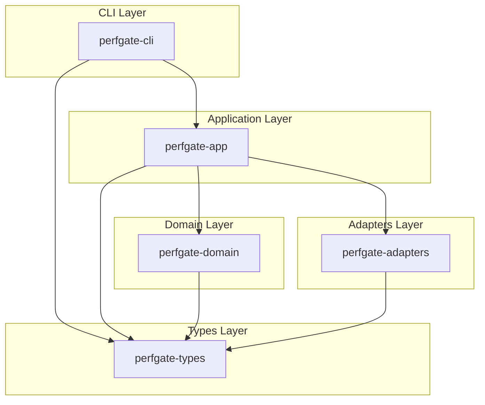

# Design Document: perfgate CLI

## Overview

perfgate is a Rust CLI tool for performance budgets and baseline diffs in CI/PR workflows. The architecture follows clean architecture principles with layered crates where dependencies flow inward only.

The tool provides four main commands:
1. `run` - Execute benchmarks and emit Run_Receipt JSON
2. `compare` - Compare current vs baseline receipts and emit Compare_Receipt JSON
3. `md` - Render Markdown summary from Compare_Receipt
4. `github-annotations` - Emit GitHub Actions annotation lines

## Architecture



### Crate Responsibilities

| Crate | Responsibility | I/O |
|-------|---------------|-----|
| perfgate-types | Receipt structs, config schema, metric/budget/verdict types, JSON schema derivation | None |
| perfgate-domain | Statistics computation (median, min, max), budget comparison logic | None |
| perfgate-adapters | ProcessRunner trait, StdProcessRunner impl, Unix rusage collection | Yes |
| perfgate-app | Use-cases (RunBench, Compare), Clock trait, Markdown/annotation rendering | Minimal |
| perfgate-cli | Clap command definitions, file I/O, exit code handling | Yes |

## Components and Interfaces

### ProcessRunner Trait (perfgate-adapters)

```rust
pub trait ProcessRunner {
    fn run(&self, spec: &CommandSpec) -> Result<RunResult, AdapterError>;
}

pub struct CommandSpec {
    pub argv: Vec<String>,
    pub cwd: Option<PathBuf>,
    pub env: Vec<(String, String)>,
    pub timeout: Option<Duration>,
    pub output_cap_bytes: usize,
}

pub struct RunResult {
    pub wall_ms: u64,
    pub exit_code: i32,
    pub timed_out: bool,
    pub max_rss_kb: Option<u64>,
    pub stdout: Vec<u8>,
    pub stderr: Vec<u8>,
}
```

The `StdProcessRunner` implementation:
- On Unix: Uses `wait4()` syscall to collect rusage including `ru_maxrss`
- On non-Unix: Falls back to `std::process::Command` without rusage
- Handles timeout via `WNOHANG` polling and `SIGKILL`

### Clock Trait (perfgate-app)

```rust
pub trait Clock: Send + Sync {
    fn now_rfc3339(&self) -> String;
}
```

Enables testability by allowing injection of fixed timestamps.

### RunBenchUseCase (perfgate-app)

```rust
pub struct RunBenchRequest {
    pub name: String,
    pub cwd: Option<PathBuf>,
    pub command: Vec<String>,
    pub repeat: u32,
    pub warmup: u32,
    pub work_units: Option<u64>,
    pub timeout: Option<Duration>,
    pub env: Vec<(String, String)>,
    pub output_cap_bytes: usize,
    pub allow_nonzero: bool,
}

pub struct RunBenchOutcome {
    pub receipt: RunReceipt,
    pub failed: bool,
    pub reasons: Vec<String>,
}
```

Orchestrates:
1. Execute warmup iterations (marked `warmup: true`)
2. Execute measured iterations
3. Compute statistics via domain layer
4. Build and return RunReceipt

### CompareUseCase (perfgate-app)

```rust
pub struct CompareRequest {
    pub baseline: RunReceipt,
    pub current: RunReceipt,
    pub budgets: BTreeMap<Metric, Budget>,
    pub baseline_ref: CompareRef,
    pub current_ref: CompareRef,
    pub tool: ToolInfo,
}
```

Orchestrates:
1. Extract stats from both receipts
2. Call domain `compare_stats()` to compute deltas and verdict
3. Build and return CompareReceipt

### Domain Functions (perfgate-domain)

```rust
pub fn summarize_u64(values: &[u64]) -> Result<U64Summary, DomainError>;
pub fn summarize_f64(values: &[f64]) -> Result<F64Summary, DomainError>;
pub fn compute_stats(samples: &[Sample], work_units: Option<u64>) -> Result<Stats, DomainError>;
pub fn compare_stats(
    baseline: &Stats,
    current: &Stats,
    budgets: &BTreeMap<Metric, Budget>,
) -> Result<Comparison, DomainError>;
```

### Rendering Functions (perfgate-app)

```rust
pub fn render_markdown(compare: &CompareReceipt) -> String;
pub fn github_annotations(compare: &CompareReceipt) -> Vec<String>;
```

## Data Models

### Run Receipt (perfgate.run.v1)

```rust
pub struct RunReceipt {
    pub schema: String,           // "perfgate.run.v1"
    pub tool: ToolInfo,
    pub run: RunMeta,
    pub bench: BenchMeta,
    pub samples: Vec<Sample>,
    pub stats: Stats,
}

pub struct Sample {
    pub wall_ms: u64,
    pub exit_code: i32,
    pub warmup: bool,
    pub timed_out: bool,
    pub max_rss_kb: Option<u64>,
    pub stdout: Option<String>,
    pub stderr: Option<String>,
}

pub struct Stats {
    pub wall_ms: U64Summary,
    pub max_rss_kb: Option<U64Summary>,
    pub throughput_per_s: Option<F64Summary>,
}

pub struct U64Summary {
    pub median: u64,
    pub min: u64,
    pub max: u64,
}
```

### Compare Receipt (perfgate.compare.v1)

```rust
pub struct CompareReceipt {
    pub schema: String,           // "perfgate.compare.v1"
    pub tool: ToolInfo,
    pub bench: BenchMeta,
    pub baseline_ref: CompareRef,
    pub current_ref: CompareRef,
    pub budgets: BTreeMap<Metric, Budget>,
    pub deltas: BTreeMap<Metric, Delta>,
    pub verdict: Verdict,
}

pub struct Delta {
    pub baseline: f64,
    pub current: f64,
    pub ratio: f64,
    pub pct: f64,
    pub regression: f64,
    pub status: MetricStatus,
}

pub struct Verdict {
    pub status: VerdictStatus,    // Pass | Warn | Fail
    pub counts: VerdictCounts,
    pub reasons: Vec<String>,
}
```

### Metric and Budget Types

```rust
pub enum Metric {
    WallMs,
    MaxRssKb,
    ThroughputPerS,
}

pub enum Direction {
    Lower,   // Lower values are better (wall_ms, max_rss_kb)
    Higher,  // Higher values are better (throughput_per_s)
}

pub struct Budget {
    pub threshold: f64,       // Fail threshold (e.g., 0.20 = 20%)
    pub warn_threshold: f64,  // Warn threshold
    pub direction: Direction,
}
```


## Correctness Properties

*A property is a characteristic or behavior that should hold true across all valid executions of a system—essentially, a formal statement about what the system should do. Properties serve as the bridge between human-readable specifications and machine-verifiable correctness guarantees.*

### Property 1: Statistics Computation Correctness

*For any* non-empty list of u64 values, the computed summary SHALL have:
- `median` equal to the middle value (or average of two middle values for even-length lists)
- `min` equal to the smallest value
- `max` equal to the largest value

**Validates: Requirements 3.1, 3.2, 3.3**

### Property 2: Warmup Sample Exclusion

*For any* list of samples containing both warmup and non-warmup samples, the computed statistics SHALL only reflect non-warmup samples. Adding or modifying warmup samples SHALL NOT change the computed statistics.

**Validates: Requirements 3.4**

### Property 3: Throughput Calculation

*For any* sample with wall_ms > 0 and work_units > 0, the computed throughput_per_s SHALL equal `work_units / (wall_ms / 1000.0)`.

**Validates: Requirements 1.4, 2.5**

### Property 4: Metric Status Determination

*For any* baseline value, current value, threshold, warn_threshold, and direction:
- If regression > threshold, status SHALL be Fail
- If warn_threshold <= regression <= threshold, status SHALL be Warn
- If regression < warn_threshold, status SHALL be Pass

Where regression is computed as:
- For Direction::Lower: `max(0, (current - baseline) / baseline)`
- For Direction::Higher: `max(0, (baseline - current) / baseline)`

**Validates: Requirements 5.1, 5.2, 5.3**

### Property 5: Verdict Aggregation

*For any* set of metric statuses:
- If any metric has Fail status, verdict SHALL be Fail
- Else if any metric has Warn status, verdict SHALL be Warn
- Else verdict SHALL be Pass

**Validates: Requirements 5.4, 5.5, 5.6**

### Property 6: Markdown Rendering Completeness

*For any* valid CompareReceipt, the rendered Markdown SHALL contain:
- A header with the correct verdict emoji (✅ for Pass, ⚠️ for Warn, ❌ for Fail)
- The benchmark name
- A table row for each metric in deltas
- All verdict reasons (if any)

**Validates: Requirements 7.2, 7.3, 7.4, 7.5**

### Property 7: GitHub Annotation Generation

*For any* valid CompareReceipt:
- Metrics with Fail status SHALL produce exactly one `::error::` annotation
- Metrics with Warn status SHALL produce exactly one `::warning::` annotation
- Metrics with Pass status SHALL produce no annotations
- Each annotation SHALL contain the bench name, metric name, and delta percentage

**Validates: Requirements 8.2, 8.3, 8.4, 8.5**

### Property 8: Serialization Round-Trip

*For any* valid RunReceipt, serializing to JSON then deserializing SHALL produce an equivalent value.
*For any* valid CompareReceipt, serializing to JSON then deserializing SHALL produce an equivalent value.

**Validates: Requirements 10.1, 10.2**

### Property 9: Parser Robustness (Fuzz)

*For any* arbitrary byte sequence, attempting to parse it as a RunReceipt or CompareReceipt SHALL NOT panic. The parser SHALL either succeed with a valid receipt or return an error.

**Validates: Requirements 10.3**

## Error Handling

### Error Categories

| Category | Exit Code | Examples |
|----------|-----------|----------|
| Tool Error | 1 | I/O failure, JSON parse error, spawn failure, invalid arguments |
| Budget Violation | 2 | Any metric exceeds fail threshold |
| Warn as Failure | 3 | Any metric in warn range with `--fail-on-warn` |

### Error Types by Crate

**perfgate-domain (DomainError)**:
- `NoSamples` - No non-warmup samples to compute statistics
- `InvalidBaseline` - Baseline value is zero or negative

**perfgate-adapters (AdapterError)**:
- `EmptyArgv` - Command argv is empty
- `Timeout` - Command exceeded timeout
- `TimeoutUnsupported` - Timeout requested on non-Unix platform
- `Other` - Wrapped anyhow errors for I/O failures

### Error Propagation

1. Domain errors bubble up through app layer to CLI
2. Adapter errors are wrapped with context (iteration number, command)
3. CLI maps errors to appropriate exit codes
4. All errors are printed to stderr with `{:#}` formatting for context chain

## Testing Strategy

### Unit Tests (perfgate-domain)

Focus on pure domain logic:
- `summarize_u64` / `summarize_f64` edge cases
- `compute_stats` with various sample configurations
- `compare_stats` with different budget configurations
- Median calculation for odd/even length lists

### Property-Based Tests

Using a property-based testing library (e.g., `proptest` or `quickcheck`):

1. **Statistics Properties**: Generate random sample lists, verify median/min/max invariants
2. **Round-Trip Properties**: Generate arbitrary receipts, verify JSON serialization round-trips
3. **Verdict Properties**: Generate random metric statuses, verify aggregation logic

Configuration:
- Minimum 100 iterations per property test
- Tag format: `Feature: perfgate-cli, Property N: <property_text>`

### Snapshot Tests (insta)

For rendering functions:
- `render_markdown` output for various CompareReceipt configurations
- `github_annotations` output format

### Integration Tests (assert_cmd)

For CLI behavior:
- `perfgate run` with simple commands (e.g., `true`, `sleep 0.01`)
- `perfgate compare` with fixture receipts
- `perfgate md` output format
- Exit code verification for pass/warn/fail scenarios

### Fuzz Tests (cargo-fuzz)

Existing fuzz targets:
- `parse_run_receipt` - Fuzz JSON parsing of RunReceipt
- `parse_compare_receipt` - Fuzz JSON parsing of CompareReceipt
- `render_markdown` - Fuzz markdown rendering with arbitrary CompareReceipt

Goal: No panics on any input.
